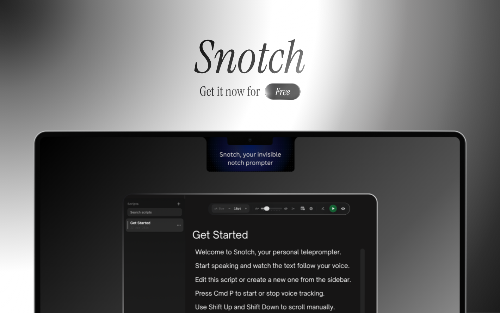

# Snotch

	

Snotch is an open-source teleprompter for macOS that follows your voice and presents a clean, notch-style overlay for on-camera scripts. It’s designed for creators who want precise, natural-paced delivery while recording or presenting.

	
	<h1 style="margin-top:12px;">Snotch — Smart Teleprompter for macOS</h1>
	

		A local, offline teleprompter that follows your voice. Built for creators, presenters, interviews, meetings, and live delivery.
		 
		<strong>Downloads for</strong>
		<a href="/Snotch-1.0.dmg">macOS</a>
	

	

		<a href="https://www.snotch.app/" target="_blank" rel="noopener noreferrer"> Visit Website</a>
		&nbsp;&nbsp;•&nbsp;&nbsp;
		
	

	

		
	

	

	<h2 style="margin-top:12px; margin-bottom:6px;">Snotch — Voice-synced teleprompter for macOS</h2>

	<!-- Website & Product Hunt buttons -->
	

		<a href="https://www.snotch.app/" target="_blank" rel="noopener noreferrer" style="text-decoration:none; margin-right:12px;">
			Visit Website
		</a>
		<a href="https://www.producthunt.com/products/snotch" target="_blank" rel="noopener noreferrer" style="text-decoration:none; margin-left:12px;">
			Product Hunt
		</a>
	

	

		
	

## About

Snotch is a lightweight, local-first teleprompter for macOS that follows your voice to advance text in natural timing. It’s intended for creators, presenters, and educators who want confident delivery without cloud dependencies.

## Highlights

- Voice-synced scrolling that follows speaking cadence
- Two reading modes: Highlighted (line emphasis) and Continuous (smooth scroll)
- Built-in audio tuning (noise gate, input gain) and live VU meter
- Script import/export (TXT, Markdown, PDF) and simple in-app editor
- Native macOS (SwiftUI) with small footprint

## Quick links & badges

- App (build): `Snotch/Snotch.app` (open `Snotch.xcodeproj` in Xcode)
- Download (built DMG): `Snotch-1.0.dmg` (release artifact)

 

	

## How to Use (Quick)

1. Open `Snotch` from your Applications folder or run the built app.
2. Paste your script into the editor or import a `.txt` / `.md` / `.pdf` file.
3. Minimize the editor to the notch overlay and position it near your webcam.
4. Toggle Voice mode and start speaking — the script will track your voice and advance naturally.

## Features

# Snotch - Smart Teleprompter for macOS

	

		
	

	<h1 align="center"><b>Snotch - Smart Teleprompter for macOS</b></h1>
	

		A local, offline teleprompter that follows your voice.
		 
		Built for creators, presenters, interviews, meetings, and live delivery.
		 
		 
		<b>Downloads for </b>
		<a href="/Snotch-1.0.dmg">macOS</a>
		 
	

 

	

How to Use Snotch: https://www.snotch.app/

Snotch is a desktop teleprompter that stays pinned near your camera and scrolls as you speak. It is designed to feel natural on calls, recordings, presentations, and live takes, with smooth motion, fast setup, and fully local processing.

No cloud. No API keys. No uploading your script or voice.

---

## Features

| Feature | Description |
| :--- | :--- |
| **Voice follow** | Scrolls with your speech so the script moves when you talk and settles when you pause. |
| **Invisible in capture workflows** | Built to stay out of screen recordings and video calls while you present. |
| **Smooth reading motion** | Uses tuned spring-based scrolling so movement feels natural and easy to track. |
| **Offline speech processing** | Runs locally without sending your script or voice to the cloud. |
| **Manual mode** | Lets you run the teleprompter at a fixed pace when you want full control. |
| **Always on top** | Stays near your webcam so your eyeline remains more natural on camera. |
| **Document import** | Load `.txt`, `.pdf`, or `.docx` files from the menu or drag them directly onto Snotch. |

---

## Use cases

- **Presentations**: Keep your delivery smooth without looking down at notes.
- **Video recording**: Read scripts naturally while keeping your eyes close to the camera.
- **Meetings and demos**: Stay on message with key talking points always in view.
- **Interviews and podcasts**: Track questions, intros, and transitions without losing flow.
- **Live streaming**: Follow prepared segments with a cleaner, more confident delivery.

---

## How it works

1. Double-click Snotch to open the editor, paste your script, or load a `.txt`, `.pdf`, or `.docx` document from the menu.
2. Minimize back into the pill and position Snotch near your webcam.
3. Choose between Voice mode and Manual mode from the settings menu.
4. Use the settings menu any time to adjust font, theme, opacity, microphone, notes, and other presentation settings.

### Modes

- **Voice mode**: Voice Follow stays active while you speak, helping the script track your delivery.
- **Manual mode**: Scroll at a controlled pace when you prefer a fixed rhythm instead of speech-driven movement.

---

## Privacy

Snotch is built for local-first use. Audio processing happens on your machine, and the app is designed around offline teleprompting rather than cloud transcription workflows.

---

## License

Distributed under the MIT License. See [LICENSE](LICENSE) for more information.

---

## Star History

