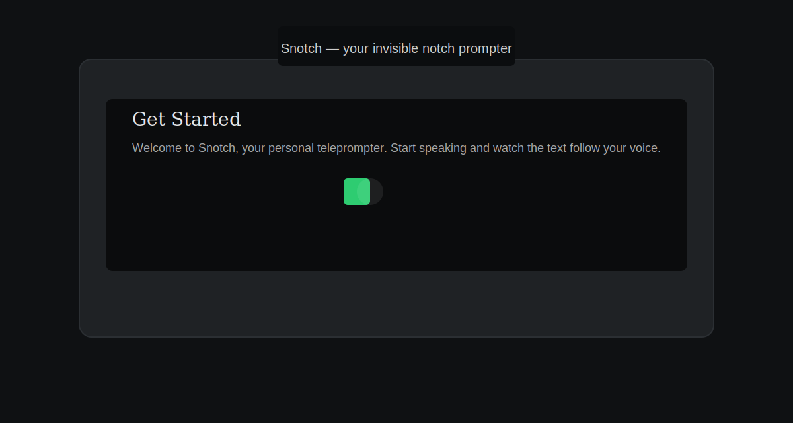

# Snotch

<p align="center">
	
</p>

Snotch is an open-source teleprompter for macOS that follows your voice and presents a clean, notch-style overlay for on-camera scripts. It’s designed for creators who want precise, natural-paced delivery while recording or presenting.
<p align="center">
	
	<h1 style="margin-top:12px;">Snotch — Smart Teleprompter for macOS</h1>
	<p style="max-width:760px; margin:8px auto; color:#666;">
		A local, offline teleprompter that follows your voice. Built for creators, presenters, interviews, meetings, and live delivery.
		<br />
		<strong>Downloads for</strong>
		<a href="/Snotch-1.0.dmg">macOS</a>
	</p>

	<p>
		<a href="https://www.snotch.app/" target="_blank" rel="noopener noreferrer"> Visit Website</a>
		&nbsp;&nbsp;•&nbsp;&nbsp;
		<a href="https://www.producthunt.com/products/snotch" target="_blank" rel="noopener noreferrer"></a>
	</p>

	<p align="center">
		
	</p>
</p>

Highlights
 - Voice-synced scrolling that follows speaking cadence
 - Two reading modes: Highlighted (line emphasis) and Continuous (smooth scroll)
 - Built-in audio tuning (noise gate, input gain) and live VU meter
 - Script import/export (TXT, Markdown, PDF) and simple in-app editor
 - Small, fast native macOS app (SwiftUI)

Quick links
 - App: `Snotch/Snotch.app` (build with Xcode)
Badges

[](LICENSE)
[](https://www.snotch.app/)

<p align="center">
	
</p>

Installation (Developer)
1. Clone the repository:

```bash
git clone https://github.com/LMGXENON/Snotch.git
cd Snotch
```

2. Open the Xcode project and build the Release target:

```bash
open Snotch.xcodeproj
# In Xcode: select the 'Snotch' scheme, choose a macOS target, then Product → Build
```

3. To produce a distributable DMG (script provided):

```bash
./scripts/create-dmg.sh
```

Notes
 - This repository no longer contains a running backend server or license key server. Any previously included server code or CSV exports were removed to simplify the open-source distribution.
 - This repository no longer contains a running backend server or license key server. Any previously included server code or CSV exports were removed to simplify the open-source distribution.

Contributing
We welcome contributions. To contribute:

1. Open an issue describing the change or bug.
2. Create a branch from `main` named `feature/your-change`.
3. Submit a clean PR with tests where applicable and a short description.

Code of conduct
Be kind and respectful. This project follows a standard open-source Code of Conduct.

License
This project is released under the MIT License — see `LICENSE` for details.

Maintainers
- LMGXENON

Contact
- Feedback and bugs: https://github.com/LMGXENON/Snotch/issues

---
_This README was updated to reflect that backend and license-server code has been removed for this open-source release._

How to Use (Quick)
------------------

1. Open the app, paste your script or import a file.
2. Minimize the editor into the notch overlay and position near your webcam.
3. Toggle Voice mode and start speaking — the text will follow your voice in natural timing.

Product Hunt & Website Copy
---------------------------

Suggested short tagline (for Product Hunt):

"Snotch — a voice-synced teleprompter for macOS that follows your speech, not your cursor."

Two-sentence summary (for website hero or Product Hunt description):

"Snotch is a lightweight macOS teleprompter that listens to your voice and advances text in natural, human timing. It provides high-contrast notch-style overlays, precise audio tuning, and a distraction-free editing workflow for creators and presenters."

Longer blurb (for website meta or Product Hunt long description):

"Snotch brings teleprompter-grade timing to your recordings by syncing the script to your speech in real time. Designed for creators, presenters, and educators, Snotch combines a compact notch overlay with advanced audio tuning (noise gate, input gain, live VU) and two reading modes. Import or edit scripts in-app, export to standard formats, and focus on delivery — not scrolling."

Suggested tags: `macOS`, `open-source`, `teleprompter`, `content-creation`, `accessibility`

How to publish this project on Product Hunt
1. Use the short tagline as the headline.
2. Paste the two-sentence summary into the tagline/intro box.
3. Use the longer blurb as the project description/details.
4. Attach 1–2 screenshots showing the notch overlay and the in-app editor.
5. Add suggested tags above and link to the GitHub repo and the website.

